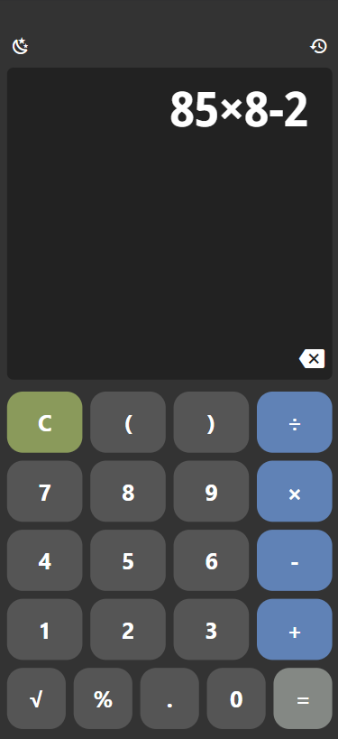
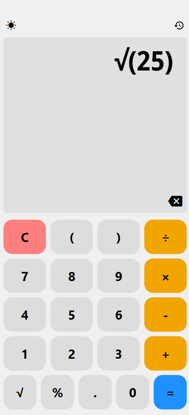
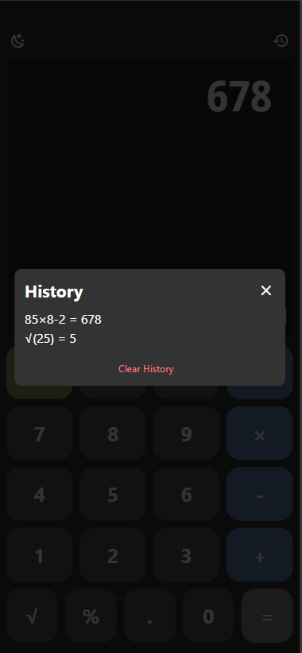

# Simple Calculator App

This is a basic calculator application built using **React Native** with the **Expo framework**. The app supports basic arithmetic operations and includes simple validation checks.

      


## Features 🧮

- Basic arithmetic operations: addition, subtraction, multiplication, and division.
- Advanced operations: square root (\√), percentage (%), and parentheses ( () ).
- History feature to view previous calculations.
- Basic input validation.
- Clean and simple UI.

## Screenshots 📸

<div align="center">
  
  
  
</div>

## Prerequisites 🛠️

Before you can run or build this app, ensure you have the following tools installed:

1. **Node.js** (version 14 or higher): [Download Node.js](https://nodejs.org/)
2. **Expo CLI**: Install it globally using npm:

   ```bash
   npm install -g expo-cli
   ```
3. **Visual Studio Code** (for development): [Download VS Code](https://code.visualstudio.com/)
4. **Android Studio** (for Android builds) and/or **Xcode** (for iOS builds).
5. **EAS CLI** (Expo Application Services CLI):

   ```bash
   npm install -g eas-cli
   ```

## Getting Started 🚀

Follow these steps to set up and run the app on your local machine.

### 1. Clone the Repository

```bash
git clone https://github.com/im-ushan-ikshana/calculator-app.git
cd calculator-app
```

### 2. Install Dependencies

Install the required dependencies using npm:

```bash
npm install
```

### 3. Open in Visual Studio Code

Open the project directory in Visual Studio Code:

```bash
code .
```

### 4. Run the App Locally with Expo CLI

To start the development server, run the following command:

```bash
expo start
```

If you encounter any unexpected errors during startup, clear the cache by running:

```bash
expo start -c
```

> **Note:** Ensure that **Developer Options** are enabled on your device or emulator to successfully run the app.

This will open the Expo Developer Tools in your browser. You can run the app on your device using the Expo Go app (available on Android and iOS) or on a simulator/emulator:

- **For iOS**:
  - Press `i` to open the app in an iOS simulator (Xcode required).
- **For Android**:
  - Press `a` to open the app in an Android emulator (Android Studio required).

## Building the App with EAS 📦

### 1. Configure EAS Build

If you haven't set up EAS for your project yet, initialize it with:

```bash
eas build:configure
```

This will generate an `eas.json` file.

### 2. Build for iOS

Run the following command to build the iOS app:

```bash
eas build -p ios
```

After the build completes, download the `.ipa` file and open it in Xcode to run it on a simulator or physical device.

#### Running the iOS Build in Xcode

1. Open the project workspace in Xcode:

   ```bash
   open ios/YourAppName.xcworkspace
   ```

2. Select a simulator or a connected device.
3. Press the **Play button** or `Cmd + R` to run the app.

### 3. Build for Android

Run the following command to build the Android app:

```bash
eas build -p android
```

After the build completes, download the `.apk` or `.aab` file and open it in Android Studio to run it on an emulator or physical device.

#### Running the Android Build in Android Studio

1. Open **Android Studio**.
2. Select **Open an Existing Project** and navigate to your project's `android` directory.
3. Choose a connected device or emulator.
4. Press the **Run button** or `Shift + F10` to run the app.

## Additional Notes 📝

- Ensure you have configured the appropriate certificates and provisioning profiles for iOS builds.
- For Android builds, make sure you have set up a keystore for signing the APK.

## License 📜

This project is licensed under the **MIT License**. 

[](./LICENSE)


---

Happy coding! 😊✨
